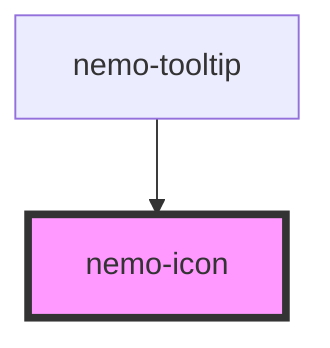

# nemo-icon

<!-- Auto Generated Below -->

## Overview

Nemo icon — renders one icon from the design system's optimized set
(source SVGs in `packages/components/icons/`, optimized via SVGO into the
generated `icons.generated.ts` registry by `npm run icons:build`).

Tokenized by design: every icon strokes in `currentColor`, so it inherits
whatever color its context already has (a button's label color, a text
input's icon color, plain text) — there is no per-icon color prop and no
hex anywhere in this component.

Accessibility: an icon is treated as **decorative** by default
(`aria-hidden="true"`) because it almost always sits next to text or
inside a labelled control (e.g. `nemo-button`'s `accessible-label`). Pass
`label` only when the icon is the *sole* accessible content — this
switches it to `role="img"` + `aria-label` instead.

## Properties

| Property            | Attribute | Description                                                                                                                        | Type                                                                                                                                                | Default     |
| ------------------- | --------- | ---------------------------------------------------------------------------------------------------------------------------------- | --------------------------------------------------------------------------------------------------------------------------------------------------- | ----------- |
| `label`             | `label`   | Accessible name. Omit for a decorative icon that's already described by its context (the common case — e.g. inside `nemo-button`). | `string \| undefined`                                                                                                                               | `undefined` |
| `name` _(required)_ | `name`    | Icon name — must match a key generated from `icons/*.svg`.                                                                         | `"alert-circle" \| "alert-triangle" \| "arrow-right" \| "check" \| "chevron-down" \| "close" \| "eye" \| "eye-off" \| "info" \| "mail" \| "search"` | `undefined` |
| `size`              | `size`    | Pixel size (square). Defaults to 24, matching every source icon's viewBox.                                                         | `number`                                                                                                                                            | `24`        |

## Shadow Parts

| Part    | Description                     |
| ------- | ------------------------------- |
| `"svg"` | The underlying `<svg>` element. |

## Dependencies

### Used by

 - [nemo-tooltip](../tooltip)

### Graph

----------------------------------------------

*Built with [StencilJS](https://stenciljs.com/)*
