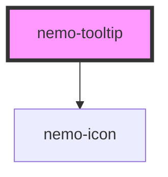

# nemo-tooltip

<!-- Auto Generated Below -->

## Overview

Nemo tooltip. Implements the Figma `Tooltip` component (node 1012-2066 /
component set 10978-23978): a short, non-interactive hint revealed on hover
or keyboard focus of a trigger, positioned to one of four sides.

Wrap any trigger in the default slot:
`<nemo-tooltip content="Hint"><button>Hover me</button></nemo-tooltip>`.
With no slotted trigger, a built-in `info` icon is rendered instead — the
pattern used throughout the Figma file — styled `full` (filled) or
`outlined` via `iconVariant`.

Visibility is CSS-driven (`:hover` / `:focus-within`) so mouse and keyboard
behave identically, per the Figma spec: tooltips must appear on keyboard
focus, disappear when hover/focus is removed, and never contain
interactive content. The trigger is linked to the tooltip text via
`aria-describedby` (the tooltip is a description, never the trigger's only
accessible name).

Colors reference the semantic token tier only (`--nemo-color-*`). Spacing,
radius and typography use resolved Figma values directly until those
foundations get dedicated token tiers (future, additive).

## Properties

| Property               | Attribute          | Description                                                                                                                                                                                                  | Type                                     | Default              |
| ---------------------- | ------------------ | ------------------------------------------------------------------------------------------------------------------------------------------------------------------------------------------------------------ | ---------------------------------------- | -------------------- |
| `accessibleLabel`      | `accessible-label` | Accessible name for the built-in icon trigger (icon-only control — requires an accessible name per the a11y baseline). Ignored when a custom trigger is slotted (that element owns its own accessible name). | `string`                                 | `'More information'` |
| `content` _(required)_ | `content`          | Tooltip text. Keep it brief — per Figma: 1-5 words, max 1-2 short sentences.                                                                                                                                 | `string`                                 | `undefined`          |
| `iconVariant`          | `icon-variant`     | Style of the built-in info-icon trigger. Ignored when a custom trigger is slotted.                                                                                                                           | `"full" \| "outlined"`                   | `'full'`             |
| `position`             | `position`         | Which side the tooltip opens toward.                                                                                                                                                                         | `"bottom" \| "left" \| "right" \| "top"` | `'bottom'`           |

## Slots

| Slot | Description                                                  |
| ---- | ------------------------------------------------------------ |
|      | Optional custom trigger. Falls back to a built-in info icon. |

## Shadow Parts

| Part             | Description                                                   |
| ---------------- | ------------------------------------------------------------- |
| `"content"`      | The floating tooltip content panel.                           |
| `"icon-trigger"` | The built-in icon-trigger button (no custom trigger slotted). |
| `"trigger"`      | The trigger wrapper (custom trigger case).                    |

## Dependencies

### Depends on

- [nemo-icon](../icon)

### Graph

----------------------------------------------

*Built with [StencilJS](https://stenciljs.com/)*
